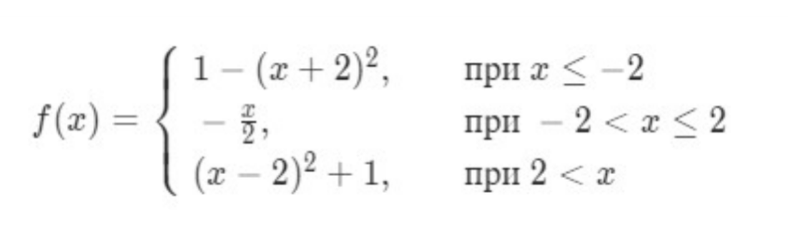

# python-tasks
Репозиторий содержит решения типовых задач на Python:

#### Задача 1  
Определите функцию count_letters(sentence, average), которая считает количество
букв в строке без учёта пробелов. У функции должен быть необязательный булевый
аргумент average, который по умолчанию равен False. Если он равен True, то
функция должна возвращать количество букв в среднем на слово.
```python
count_letters("Beep boop") # => 8
count_letters("Beep boop", average=True) # => 4
count_letters("I will build my own theme park") # => 24
count_letters("I will build my own theme park", average=True) # => 3.429
```
> Примечание: Словом считается любая последовательность символов, отделённая пробелами или
границами предложения. Cреднюю длину слова можно не округлять.

Код решения задачи написан в 

#### Задача 2
После чтения папки список файлов оказался следующим:
```python
files = ['setup.py', 'ratings.txt', 'stock_stats.txt', 'movies.txt', 'run.sh',
'game_of_thrones.mov']
```
Создайте на основе списка files новый список data, в который поместите только
файлы, содержащие в названии "txt".
Код решения задачи написан в 


#### Задача 3
Вам дается текстовый файл, содержащий некоторое количество непустых строк.
На основе него сгенерируйте новый текстовый файл, содержащий те же строки в
обратном порядке.  
**Пример входного файла:**  
ab  
c  
dde  
ff  
**Пример выходного файла:**  
ff  
dde  
c  
ab  
Код решения задачи написан в 


#### Задача 4
Вам дано описание наследования классов в формате JSON.
Описание представляет из себя массив JSON-объектов, которые соответствуют
классам. У каждого JSON-объекта есть поле **name**, которое содержит имя класса, и
поле **parents**, которое содержит список имен прямых предков.
**Пример:**
```json
[{"name": "A", "parents": []}, {"name": "B", "parents": ["A", "C"]}, {"name": "C", "parents":
["A"]}]
```
**Эквивалент на Python:**
```python
class A:
pass
class B(A, C):
pass
class C(A):
pass
```
Гарантируется, что никакой класс не наследуется от себя явно или косвенно, и что
никакой класс не наследуется явно от одного класса более одного раза.
Для каждого класса вычислите предком скольких классов он является и выведите эту
информацию в следующем формате.  
**<имя класса>** : **<количество потомков>**  
Выводить классы следует в лексикографическом порядке.  
**Sample Input:**
```json
[{"name": "A", "parents": []}, {"name": "B", "parents": ["A", "C"]}, {"name": "C", "parents":
["A"]}]
```
**Sample Output:**  
A : 3  
B : 1  
C : 2  

#### Задача 5
Напишите программу, которая считывает текст из файла (в файле может быть
больше одной строки) и выводит самое частое слово в этом тексте и через пробел
то, сколько раз оно встретилось. Если таких слов несколько, вывести
лексикографически первое (можно использовать оператор < для строк).
Слова, написанные в разных регистрах, считаются одинаковыми.
Код решения задачи написан в 


####  Задача 6
Напишите функцию f(x), которая возвращает значение следующей функции,
определённой на всей числовой прямой:

Код решения задачи написан в 

#### Задача 7
Выведите таблицу размером n×n, заполненную числами от 1 до n^2 по спирали,
выходящей из левого верхнего угла и закрученной по часовой стрелке, как показано
в примере (здесь n=5):  
**Sample Input:**
5
**Sample Output:**
1 2 3 4 5  
16 17 18 19 6  
15 24 25 20 7  
14 23 22 21 8  
13 12 11 10 9  